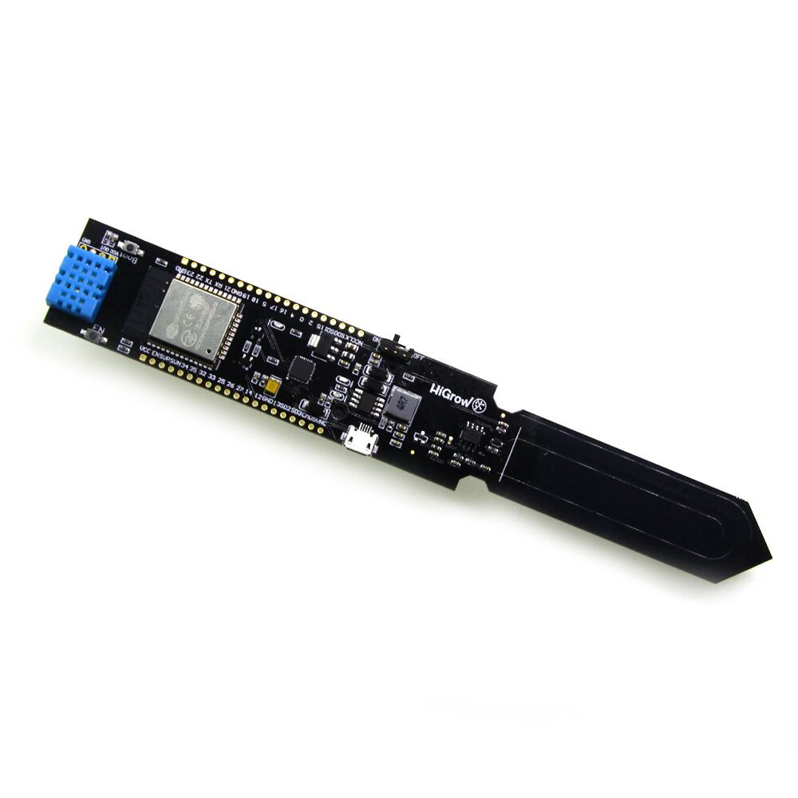

# LilyGo HiGrow ESP32 Plant Monitoring Sensor Firmware

  

## Overview

- Use this code with [MongooseOS](https://mongoose-os.com/) and the LilyGo HiGrow ESP32 Plant Monitoring Sensor board to obtain sensor readings and control LED's
- Boards can be purchased directly from LilyGo on [AliExpress](https://www.aliexpress.com/item/ESP32-WIFI-Bluetooth-battery-soil-Moisture-Senson-DHT/32815782900.html)
- Set your device `bt_devname` in the **mos.yml** file. In order for it to work with the HiGrow app, each name should start with "Higrow". According to HiGrow, this will be fixed in a future release.
- Visit http://www.higrow.tech/en/ more info on the HiGrow project.
- Luca's officially supported repo is located at https://github.com/mongoose-os-apps/lilygo-higrow-soil-temp-humi-sensor, please considering supporting his work over there.

## How to install this app using MongooseOS

- Install and start [mos tool](https://mongoose-os.com/software.html)
- Switch to the Project page, find and import this app, build and flash it:

  

